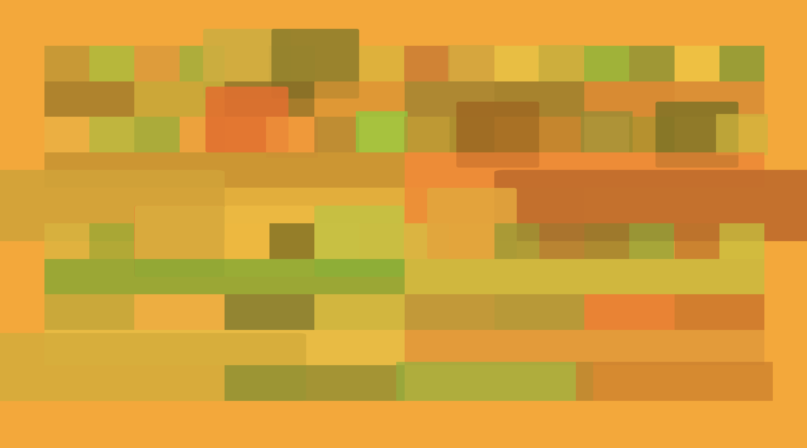

# Mandarinas

An interactive animation

In every page load it generates a completely unique grid of sounds, every sound is represented by a block that will move and grow depending on the lenght of the sound.

Blocks are grouped in rows, every block represents a pattern created with its child blocks/sounds, click a row to pause/play its pattern

https://mandarinas.netlify.app/